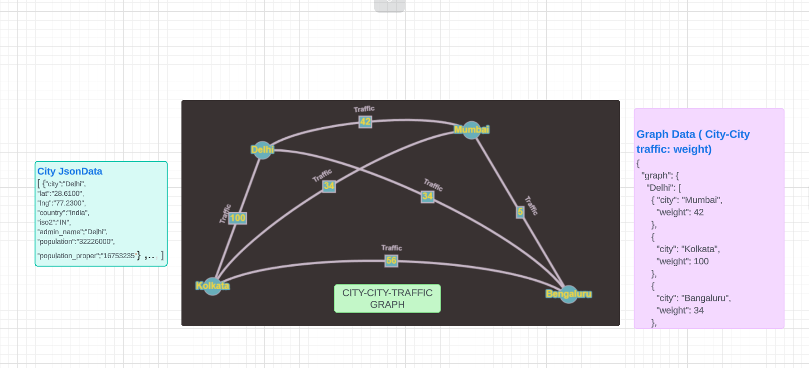
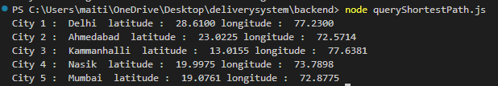
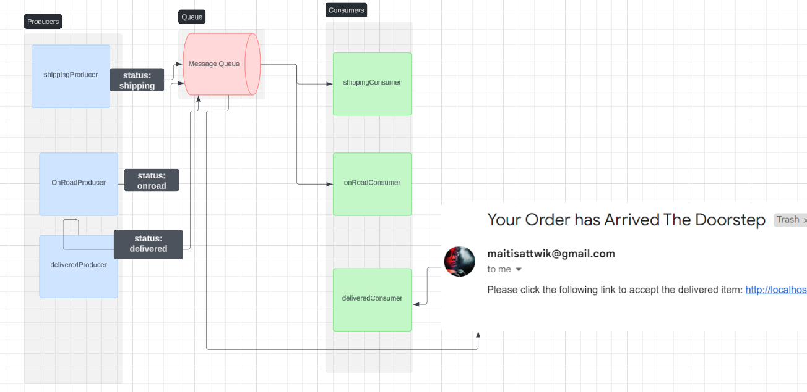
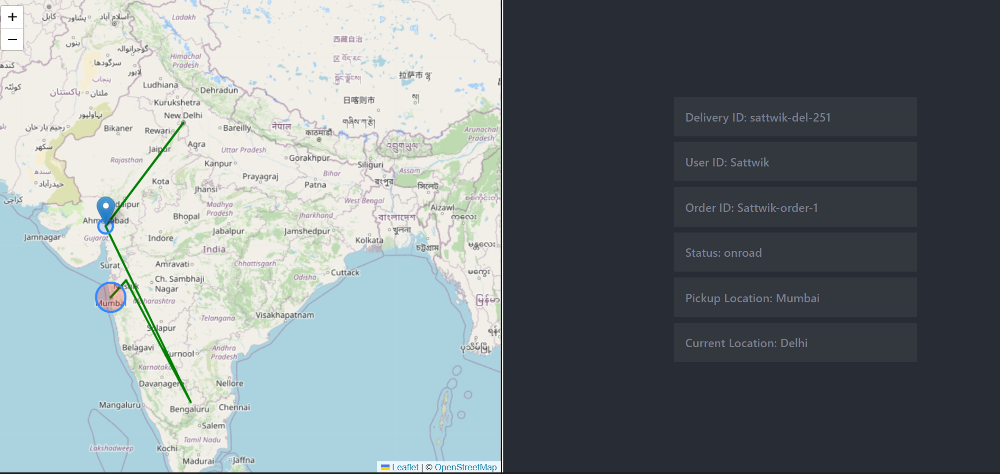

# Graph for Interconnected Cities

># We have city json data with cityname, latitude and longitude and other minor information. Now we make a weighted bidirectional graph between every city .The weight is the traffic between the two place . For simplicity we gave random numbers between 1 to 1000 as traffic weight in our project.

># A better approach could have been using Haversine Formula (using radius of earth and angle between two places : [Wikipedia - Reference](https://community.esri.com/t5/coordinate-reference-systems-blog/distance-on-a-sphere-the-haversine-formula/ba-p/902128#:~:text=For%20example%2C%20haversine(%CE%B8),longitude%20of%20the%20two%20points.)) ,we could find the distance between two places using latitutde and longitude. Then based on Rural, City, Highway segment of the road and traffic factor we could assign values: 
1. Segment 1 (City): 10 miles, average speed 20 mph, traffic factor 2.0
2. Segment 2 (Highway): 30 miles, average speed 60 mph, traffic factor 1.2
3. Segment 3 (Rural): 10 miles, average speed 50 mph, traffic factor 1.0

># Then finally calulate the time taken (traffic weight)=  (Distance / speed) *traffic_factor

># After Assigning the weights to the graph , we use shortest path finding algorithm ( Dijkstra algorithm ),to find the shortest path and also construct the path .

># Say Shortest path from Delhi to Mumbai in our Demo . 

# Live Location Track

># Using Rabbit MQ we used 3 topic-exchange : shipping, onroad, delivered .The status will get updated as the parcel moves from one city to another and it is consumed by the consumers. Finally when the parcel reaches the destination , a mail will be sent to pick up the delivery. The Live location is tracked using socket

